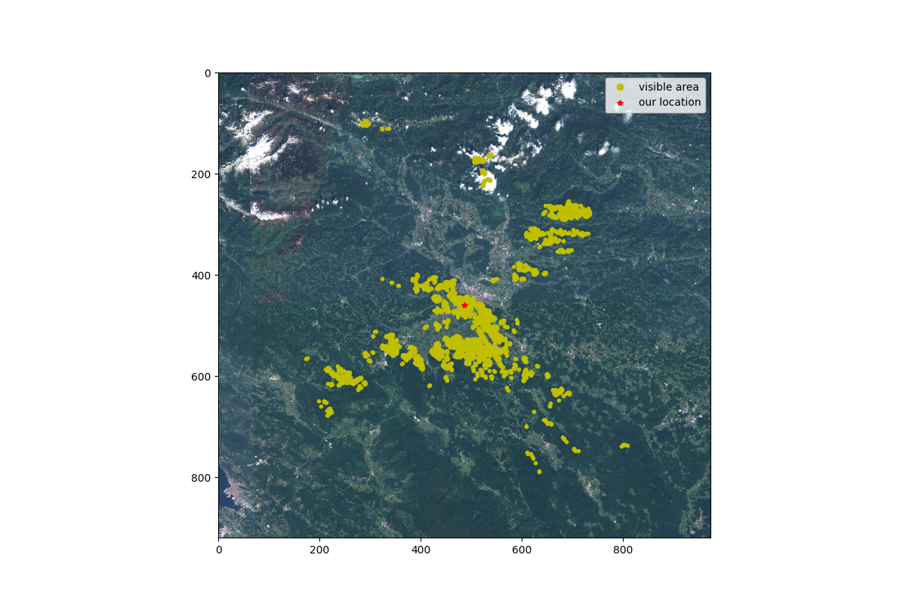

# dragonhack2020-ideapop


## Description

Building a tool that for a given location on a map evaluate the view surrounding that area, such as home builders and professional photographers. It only analyzes area that is visible from that location with the naked eye. 

Currently the tool supports capturing visible area and displaying it to the user.




For our front-end part we used Angular where we included necessary modules. In order to start the FE of our application, the following steps need to be done:

```
cd angular-leaflet-starter/
npm install -g @angular/cli
npm install
npm start
```

This part of the application is listening on port 4200 and it is available on the link: http://localhost:4200/.


For our back-end part we used python Flask where we included necessary modules. To start server create new virtual env and install packages from requirements
```
cd app/
pip install -r requirements.txt

export FLASK_APP=app.py
python -m flask run

```

This part of the application is listening on port 4200 and it is available on the link: http://localhost:5000/.